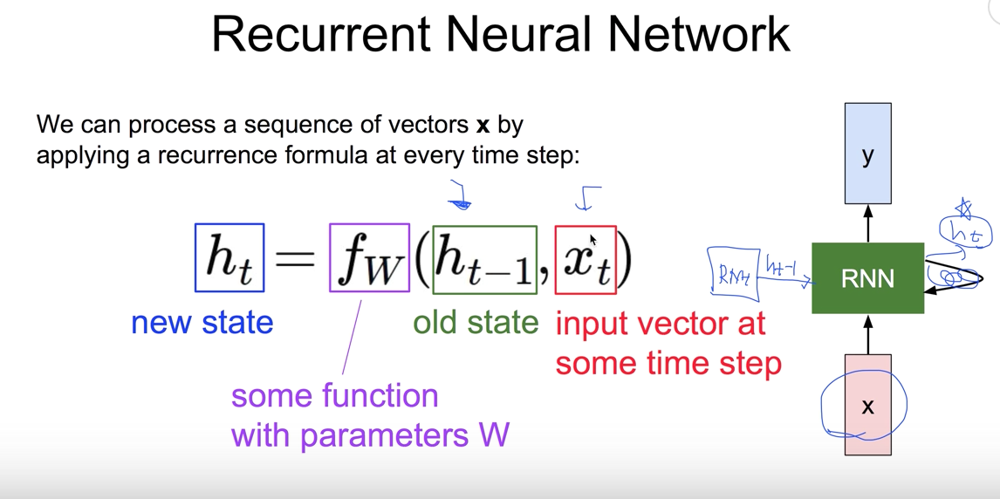
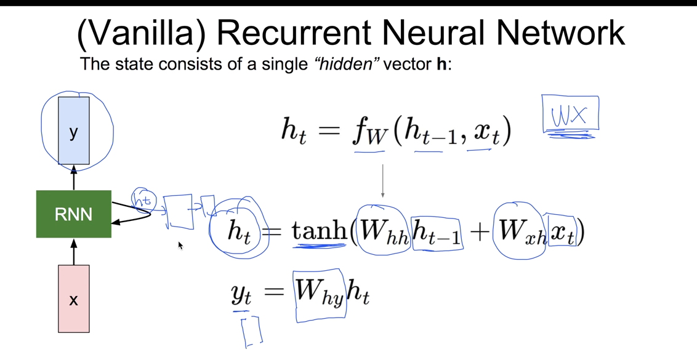
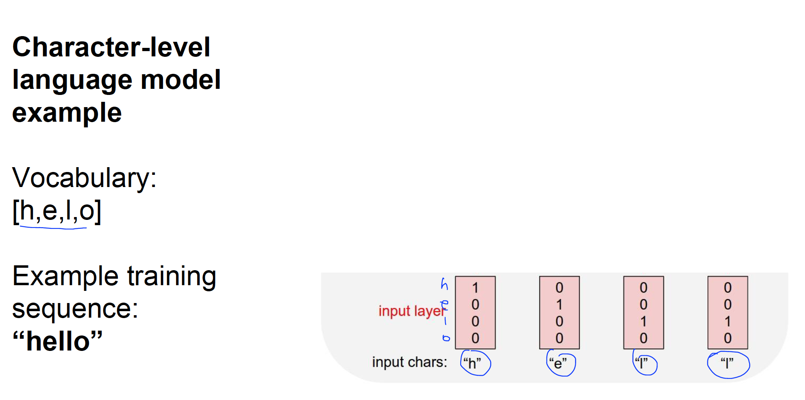
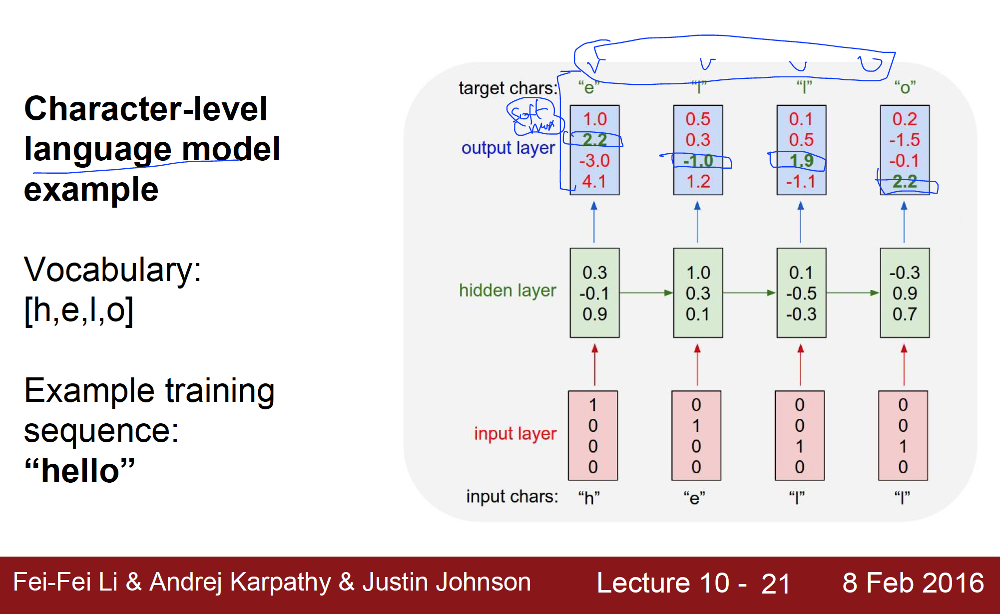

# Lecture 12
### RNN

기존의 NN들은 `입력->출력`의 간단한 형태였기 때문에 Series Data를 처리가히가 불편했다.
그래서 RNN형태를 개발하게 되었음.

이전의 연산이 그담에 연산에 영향을 끼쳐야 시리즈가 될텐데, 이것들을 해보자는 뜻에서.. 

어떤 시점에서 뭔가 계산할때 이전의 상태가 영향을 끼치는 시리즈 형태.

* Recurrent Neural Network

RNN에는 state란 개념이 있다. state를 계산할때 중요한 것은 ` 이전의 state가 입력으로 들어간다는 것`이다.

RNN의 F가 모든 RNN 셀에 대해서 동일하다.

RNN의 값을 계산하는 방법중 가장 기초가되는 RNN인 Vanilla RNN의 연산 방법

입력 ht-1과 xt에 대한 각각의 weight를 만들어줘서   

sigmoid와 같은 형태인 tanh로 해서 현재의 state를 계산함.  

계산된 ht와 다른형태의 weight를 계산해서 y를 구해냄..

Weight인 Wh Whh, Wxh, Why이게 전체 셀에 대해 똑같다는 거다.. 
그래서 하나가 있는 거랑 같은 형태라고 볼 수 있다.

example: language model  
현재 글씨가 있을때 그다음 글씨가 뭘까를 맞추는 모델.  

단어의 각각 입력 값을 벡터로 표현하는 간단한 방법중 하나 `one hot encoding`?
hell을 벡터로 표현할때, 4개의 vocabulary가 있으니 4개의 벡터로 표시하고 그 각 해당하는 vocabulary값에 1로 표시를 해주는 것
hell을 다른 multi lable이라고 생각하시면 된다.

첫번째 rnn의 ht-1은 없으니 0이라고 생각하면 됨.
두번째 rnn부터는 이전값들이 영향을 끼치지,, rnn은 어떻게 보면 이전의 것들을 잘 기억한다고 볼 수 있다.

h와 W를 곱해서 output이 나오게 된다.
output의 vector가 몇개가 될것인가는 W의 shape에 따라 결정될텐데, 
이같은 경우는 출력이 글자로 나오길 원하니 vocalbulary가 4개니깐 4개중 하나로 label이 정해진다고 생각하면 된다.

그후에 output을 Softmax를 취하게 되면 가장 큰 것을 선택하게 되면 거기에 해당하는 label이..

그다음에 나올 것이 틀리면 error라고 할 수 있겠지.

이런 값들이 실제 나온 값들이 딱 맞기 않은데,, 이건 cost를 어떻게 계산할 것인가는 softmax에 해당되는 cost함수로 쉽게 계산한다음에,, 4개 cost를 다 더한 것의 평균을 내서 학습을 시킬 수 있겠지.

이렇게 학습이 되면 그 후엔 어떤 한글자를 넣으면 계산을 거쳐서 그다음 글자는 뭐가 되겠다는 language model이 된다.

이런 rnn은 활용방법이 다양하다.
* 연관검색어
* speech recognition
* machine translation
* conversation modeling(봇)/Question answering
* Image/Video captioning
* Image/music/dance generation

이런 것은 rnn을 어떻게 활용하냐에 따라 달려있다

또 RNN에도 muli layer를 둬서 복잡한 학습이 가능하다

* 기본적인 vanilla rnn이 깊어지고 layer가 많아지다보면 학습하는데 좀 어려움이 있다. 그걸 극복하는 다른 형태의 RNN과 같은데 다른 형태중 하나가
    - LSTM(보통 RNN이라 하면 더이상 RNN자체를 쓰지않고 많은 경우에 LSTM을 쓰거나)
    - GRU

이 두개중 하나를 쓰게 된다

