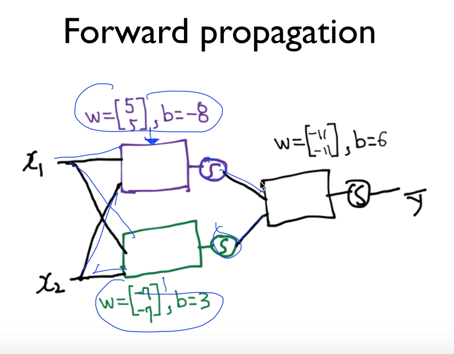
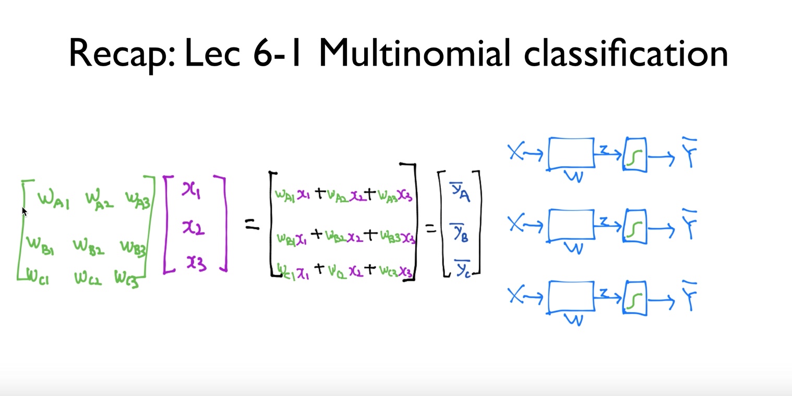
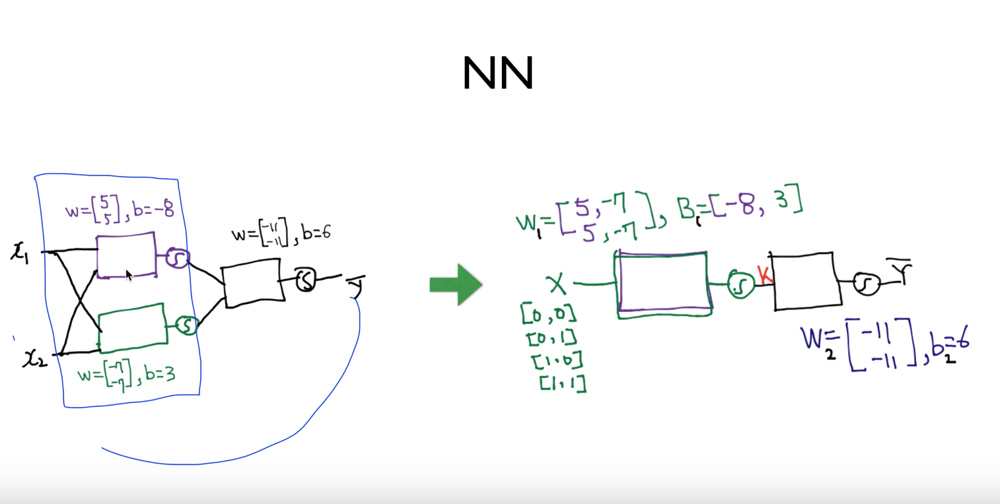
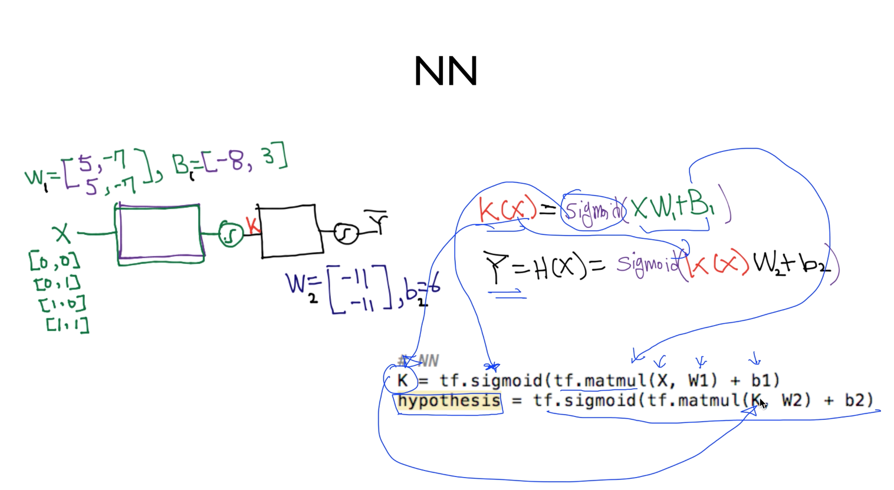
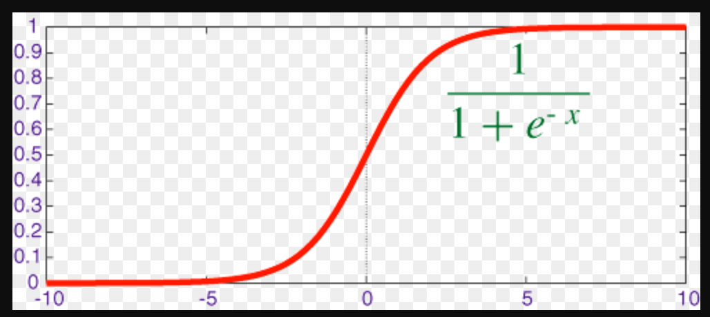

# Lecture 9-1
### Neural Nets(NN) for XOR

* 하나의 logistic regression unit으로는 XOR을 풀 수 없었음.

* multiple units으로 한다면 풀 수가 있다.
  - 3개 유닛으로 XOR 문제 해결 가능함(유닛;게이트;퍼셉트론으로 불림)


* 근데 복잡한 뉴럴넷안의 각각의 w, b를 어떻게 학습을 할까?

* Forward propagation
  - x1, x2가 각 유닛에 들어가고,
  - 각각의 출력에 sigmoid가 붙어있고, sigmoid가 다른 유닛의 입력으로 들어가고
  - 그것이 출력을 하고 sigmoid되서 최종값이 되는데
  - 이것이 하나의 Neural Networks라고 말 할 수 있다.


* 근데 W, b이외에 다른 값들이 존재하는가??


* 세개를 하나로 합치려면 벡터를 세줄로 주면 된다


* 두개의 유닛을 하나로 합치는 방법이 있었지.

이와 마찬가지로 한개지만 두개가 들어있는 거고, 대신 W이 2차원 벡터로 늘어나고 bias도 마찬가지.

* 이걸 수식으로 써보면, Hypothesis를 정할 때,



```python
# NN
K = tf.sigmoid(tf.matmul(X, W1) + b1)
hypothesis = tf.sigmoid(tf.matmul(K, W2) + b2)
```


* sigmoid function
  - 값이 괭장히 작으면 0이 되고, 크면 1이 된다.



* 어떻게 W, b를 trainging data로 부터 학습시킬 수 있을 것인가??
