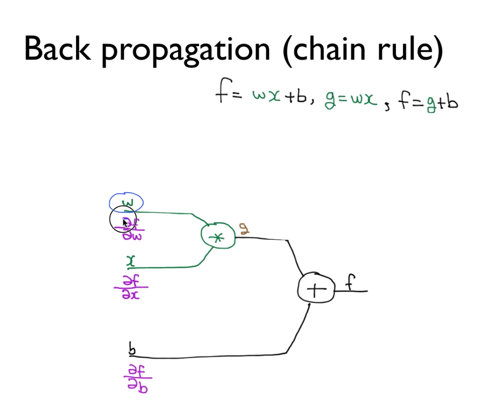
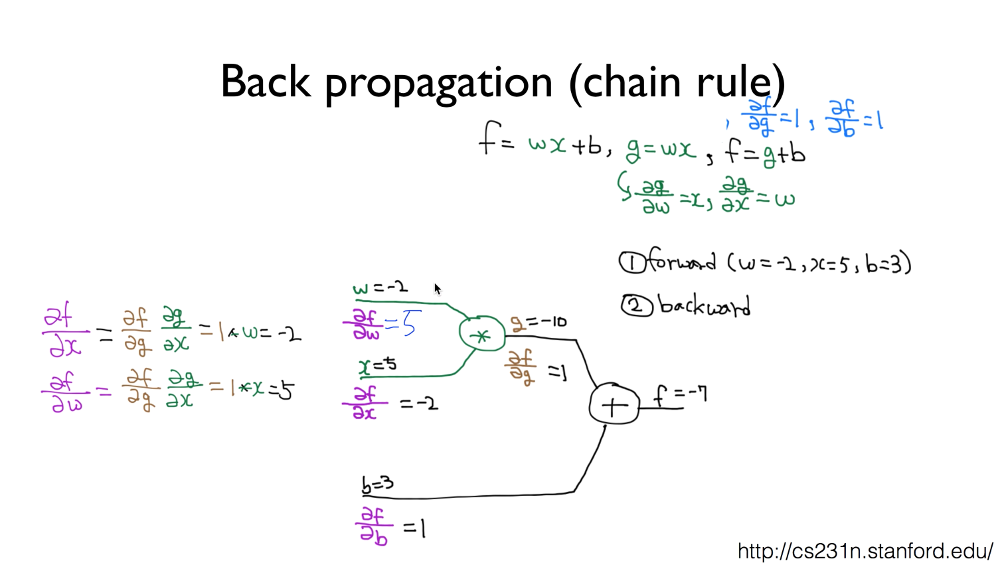
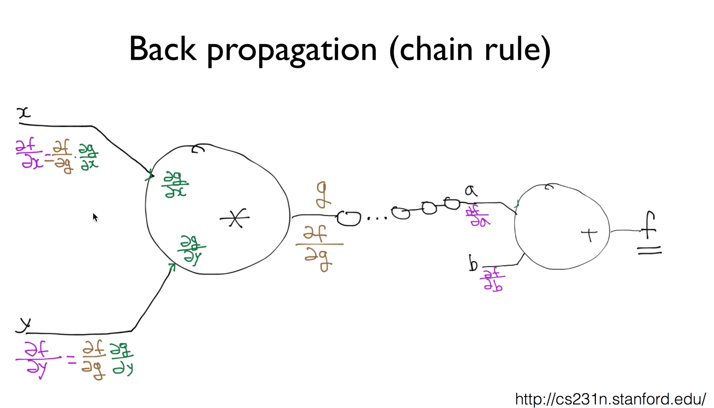
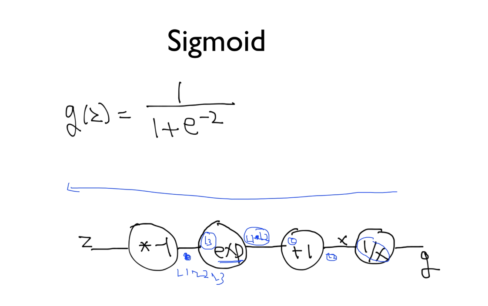
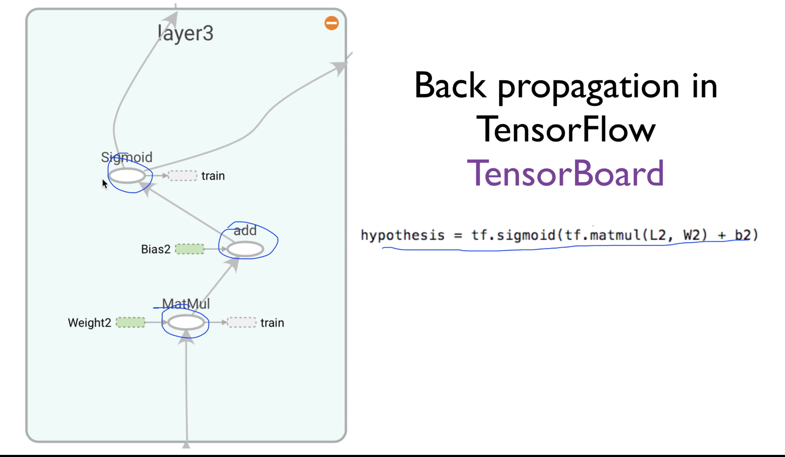
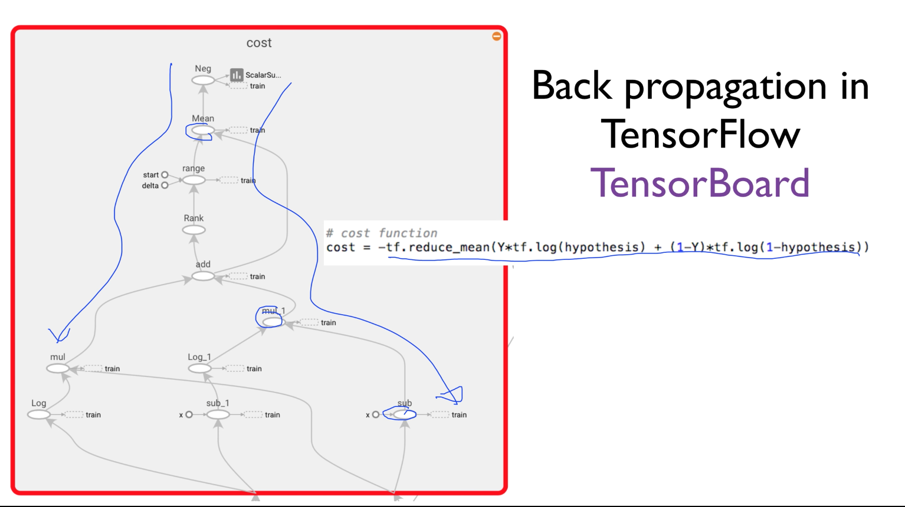

# Lecture 9-2
### Learn Deep Networks (Backpropagation)

- W, b를 자동적으로 어떻게 학습시킬지에 대해 알아보자

* Gradient Descent algorithm  
    * cost function을 정의한 후 각 점들이 w가 될 것이고  
    * w가 어떤점에서 시작하든 상관없이 그점에서의 기울기를 구해서   
    * learning_rate으로 따라 내려가면  
    * 마지막에는 가장 낮은 점(global minimum)을 구할 수 있다  
    * 이것이 cost를 최소화 하는 것이다.  

- 이걸 구현하기 위해서는 어떤 점에서의 미분값(기울기라 부르는)이 필요  
> 그래서 이 알고리즘을 적용하기 위해서는 미분을 계산해야 하는데,

* NN으로 가면서 미분값이 복잡해진다.
> node가 한 두개가 있는 것도 아니고,  
> 연산들이 중간에 sigmoid같은 것도 끼고,  
> 막 순차적으로 있다보니,,  

* 각각의 입력이 y에 끼치는 영향(미분값)을 알아야 각각의 w를 조절할 수 있는데, 이게 계산량이 많아서 어렵다. 수학적으로도..

* Backpropagation
> 우리가 예측한 값과 실제 값을 비교해서 거기에서 나온 오류(cost 형태)를 뒤에서 부터 앞으로 돌려서 이것을 미분값과 또는 실제로 어떻게 뭘 적용해야될지를 계산하겠다. 라는 알고리즘이다.

## BackPropagation(chain rule)
    * w가 f에 미치는 영향  
    * x가 f에 미치는 영향  
    * b가 f에 미치는 영향  
    * g가 f에 미치는 영향  
을 구하고 싶은데 그게 바로 미분값이 될 것임. 	

### 미분
* 편미분(굉장히 중요함)

* Back Propagation 과정 두가지로 나눠서 진행함
    1. forward propagation(실제 학습데이터에서 값을 들고와서 입력시킴 w, x, b)
    2. 그 후에 backward로 실제 미분의 값을 계산하게 됨

* 아무리 복잡한 것들이 있더라도 이걸 미분하는데 필요한 것은 위의 편미분 값 4개이다.
    * 그래서 이 것이 back propagation chain rule의 핵심이고 
    * 이런 간단한 미분만 이해할 수 있으면 어떤 복잡한 형태의 수식도 미분 가능함

* chain rule은 뭐냐면 f를 w로 미분하려면,, f에 g가 있으니 g로 f를 미분하고, 그게 끝났으면 w로 g를 미분하는 것이다.
    - 미분의 값의 의미는,, 
    - 델타f/델타b = 1: 이것은 b의 변화가 미치는 영향이 거의 1:1로 비례하다는 것이다. b가 3에서 4로 1이 올라가면 f도 거의 1만큼 올라간다는 것
    - w = -2 이고 미분한 값 델타f/델타w = 5이면, w의 값이 1만큼 바뀌면 f의 값은 5만큼 바뀐다는 것이다.
    - 이런 의미를 가지기 때문에 이 관계를 이용해서 f의 출력에 대해서 조정이 가능한 것이다

### Back Propagation에서 복잡한 경우

* 제일 먼저 가장 마지막의 노드를 계산
    - a가 f에 미치는 영향을 바로 구할 수 있지
* 이런식으로 다음 단계로 계속 넘어가면서 back propagation을 계속 진행하면 되는 거지
* 궁극적으로는 x가 f에 미치는 영향을 알고 싶어하지
    - 다른건 몰라도 x가 g에 미치는 영향은 알 수 있지
    - chain rule을 통해서 중간에 많은 게이트가 있다고 하더라도 최종 출력 값간의 미분값을 구할 수 있다.

### Sigmoid
g(z) = 1/1+e^(-2)
이걸 어떻게 미분?
델타g/델타z   -> z가g에 미치는 영향

미분하려 애쓸 필요없다
그래프로 나타내서 뒤에서부터 미분해나가면 된다

### Back propagation in TensorFlow [TensorBoard]
텐서플로우에서는 모든 것이 그래프인데,

텐서플로에서 bp 어케하냐면, hypothesis를 만들면 텐서플로는 
각각을 그래프로 만들어 놓는다.

cost funcion를 텐서플로는 각각을 그래프로 만들었는데, 왜 이렇게 만들었냐면 텐서플로가 미분하기 위해서이다. back propagation을 하려고.

#### back propagation
아주 단순한 방법으로 아무리 복잡해도 미분값;기울기를 구할 수가 있었음.

